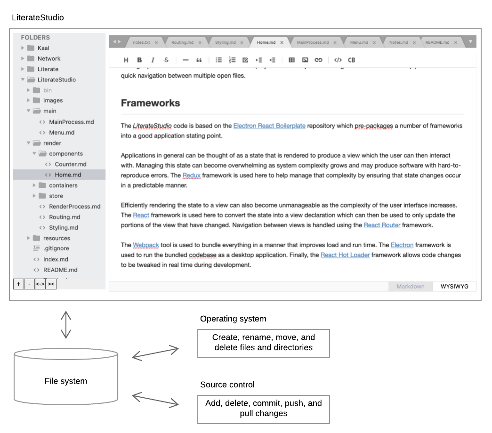
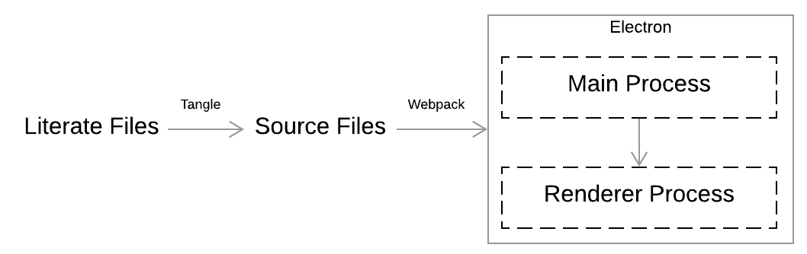
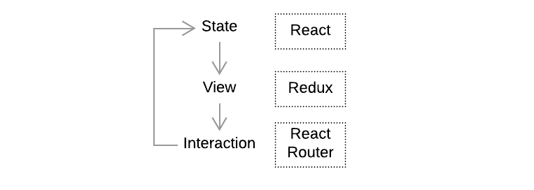

# LiterateStudio

*LiterateStudio* is a development environment for literate programming. I decided to create it after a search for a WYSIWYG editor for Markdown files failed to find any with the quick and efficient interface that I want when working on a large codebase.

## Design

The design of *LiterateStudio* is heavily inspired by [Sublime](https://www.sublimetext.com/). Its main objective is the viewing and editing of a literate web of Markdown files. It expects that you'll use your operating system to to create, rename, move, and delete files and directories and that you'll use a separate source control utility.



The left panel allows the user to browse the file system and select files for viewing in the right panel. Buttons on the bottom toolbar add and remove directories and expand and collapse all folders.

The right panel uses one of several renders to display the file contents; the renderer is selected based on the file extension. A tab control on the top provides for quick navigation between open files.

## Structure

The file that you're reading right now plus all the Markdown files that it links to collectively form the source code for *LiterateStudio*. This literate web is [tangled](https://github.com/sclaggett/Literate) into a compiler-readable format which is then bundled by [Webpack](https://webpack.github.io/docs/) into an executable.



I've grown increasingly fond of using JavaScript and web frameworks for graphical applications because of their rich development ecosystems. *LiterateStudio* uses the [Electron](https://electron.atom.io/) framework to run a web application as if it were a desktop application. 

Electron applications consists of one main process and zero or more renderer processes; we'll just use a single renderer process here. The main process lacks a user interface but has access to many low-level aspects of the host system. It spawns the renderer process which is associated with a desktop window in which the web application is running. Refer to the [main process](main/MainProcess.md) and [render process](render/RenderProcess.md) pages for details.

Applications in general can be thought of as loop in which the current state is rendered to produce a view which the user can then interact with and by doing so change the state, over and over.



Managing this state can become overwhelming as system complexity grows and can result in software plagued by hard-to-reproduce errors. We use the [Redux](https://github.com/reactjs/redux) framework to help manage that complexity by ensuring that state changes occur in a predictable manner.

Efficiently rendering the state to a view can also become unmanageable as the complexity of the user interface increases. We use the [React](https://facebook.github.io/react/) framework to convert the state into a view declaration which can then be used to only update the portions of the interface that have changed.

Navigation between views is handled using the [React Router](https://github.com/reactjs/react-router) framework.

Putting together the above pieces and getting the basic application up and running is no small feat in itself. Thankfully, the good folks over at [Electron React Boilerplate](https://github.com/electron-react-boilerplate/electron-react-boilerplate) have a pre-packaged starting point that was used here. Most of the files from the starting project are in the `resources` directory, unchanged and lacking a literate description. Frankly I'm not completely sure what's going on in there.

## State

The whole state of your app is stored in an object tree inside a single *store*.

- Root directories (array of path strings)
- Directory snapshots (array of Directory objects; Directory.path is the directory path; Directory.directories is an array of Directory objects; Directory.files is an array of File objects; File.path is the file path; File.modified is the last modified timestamp)
- Tabs (array of Tab objects; Tab.path is the file path; Tab.dirty indicates if the tab contents have not been saved)
- Active tab (Tab object)

```js
{
  "rootDirectories": [
    "/Users/Shane/Desktop/Aquarium/LiterateStudio",
    "/Users/Shane/Desktop/Aquarium/Fundus",
    ...
  ],
  "directorySnapshots": {
    "/Users/Shane/Desktop/Aquarium/LiterateStudio": {
      "files": [{
        "name": "Index.md",
        "lastModified": 172364103795
      }, {
        "name": "README.md",
        "lastModified": 172364103795
      }, ...],
      "directories": [
        "bin": {
          "directories": [...],
          "files": [...]
        },
        "images": {
          "directories": [...],
          "files": [...]
        }
      ]
    },
    "/Users/Shane/Desktop/Aquarium/Fundus": {
      ...
    }, ...
  },
  "tabs": [{
      "path": "/Users/Shane/Desktop/notes.txt",
      "dirty": false
    }, {
      "path": "/Users/Shane/Desktop/Aquarium/LiterateStudio/main/Menu.md",
      "dirty": false
    }, {
      "path": "/Users/Shane/Desktop/Aquarium/LiterateStudio/render/containers/HomePage.md",
      "dirty": true
    }
  ],
  "selectedTab": 1
}
```

The only way to change the state tree is to emit an *action*, an object describing what happened. To specify how the actions transform the state tree, you write pure *reducers*.


## User interface


## Host integration

Create a listener for the file on disk for each tab.


## Development

Start by setting up your system for Electron development as described [here](https://www.electronjs.org/docs/tutorial/development-environment).

Install yarn and clone the repository.

```sh
$ sudo npm install -g yarn
$ git clone git@github.com:sclaggett/LiterateStudio.git
$ cd LiterateStudio
```

Tangle the source, initialize dependencies, and start the application.

```sh
$ ./Tangle.sh
$ cd bin
$ yarn
$ yarn dev
```

A development iteration consists of making the desired changes to the literate source and then tangle again. The debugger generally picks up changes and updates the running application automatically. Kill and relaunch the application to get a fresh start.

