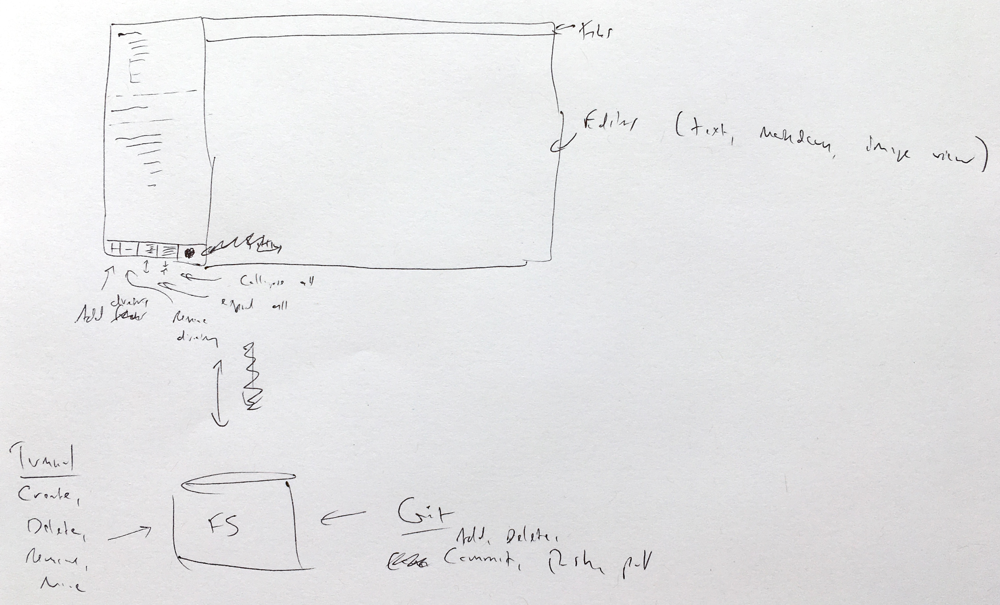

# LiterateStudio

*LiterateStudio* is a development environment for literate programming. I decided to create it after searching for a WYSIWYG editor for Markdown files and failing to find any that provided the quick and efficient interface that I want when working on a large codebase.

## Design

The design of the application is heavily inspired by Sublime. The main objective is to allow the viewing and editing of a literate web of Markdown files. It expects that you'll use your operating system to to create, rename, move, and delete files and directories and a separate source control utility.



The left panel allows the user to browse the file system and select files for viewing in the right panel. Buttons on the bar at the bottom add and remove directories and expand and collapse all folders below the currently selection.

The right panel uses one of several editors to display a file and may allow editing. A tab control on the top provides for quick navigation between multiple open files.

## Frameworks

*LiterateStudio* is based on the [Electron React Boilerplate](https://github.com/electron-react-boilerplate/electron-react-boilerplate) repository and uses a number of frameworks to simplify complex tasks and improve the end product.

Applications in general can be thought of as a state that is rendered to produce a view which the user can then interact with. Managing this state can become overwhelming as system complexity grows and lead to software with hard-to-reproduce errors. The [Redux](https://github.com/reactjs/redux) framework is used here to help manage that complexity by ensuring that state changes occur in a predictable manner.

Efficiently rendering the state to a view can also become unmanageable as the complexity of the system increases. We convert the state into a view declaration which is then processed by the [React](https://facebook.github.io/react/) framework to only update the portions of the view that have changed. Navigation between views is simplified using the [React Router](https://github.com/reactjs/react-router) framework.

The [Webpack](https://webpack.github.io/docs/) tool is used to bundle everything in a manner that improves load and run time. The [Electron](https://electron.atom.io/) framework is used to run the bundled codebase as a desktop application. Finally, the [React Hot Loader](https://github.com/gaearon/react-hot-loader) framework allows code changes to be tweaked in real time during development.

Most of the files from the boilerplate project are in the `resources` directory. They are mostly unchanged and have no literate description. Frankly I'm not completely sure what's going on in there.

## Bootstrapping


webpack.config.main.prod.babel.js:
- `build-main`, production
- Webpack config for production electron main process
- Entry point is `main.dev.ts`

webpack.config.renderer.prod.babel.js:
- `build-renderer`, production
- Build config for electron renderer process
- Entry point is `index.tsx`


webpack.config.renderer.dev.babel.js:
- `start-renderer-dev`, development
- Build config for development electron renderer process that uses hot module replacement
- Entry point is `index.tsx`
- Spawns an electron instance with the entry point `main.dev.ts`

webpack.config.renderer.dev.dll.babel.js:
- `build-dll`, development
- Builds the DLL for development electron renderer process


## State


## User interface


## Development

Start by setting up your system for Electron development as described [here](https://www.electronjs.org/docs/tutorial/development-environment).

Install yarn and clone the repository.

```sh
$ sudo npm install -g yarn
$ git clone git@github.com:sclaggett/LiterateStudio.git
$ cd LiterateStudio
```

Tangle the source, initialize dependencies, and start the application.

```sh
$ ./Tangle.sh
$ cd bin
$ yarn
$ yarn dev
```

A development iteration consists of making the desired changes to the literate source and then tangle again. The debugger generally picks up changes and updates the running application automatically. Kill and relaunch the application to get a fresh start.

